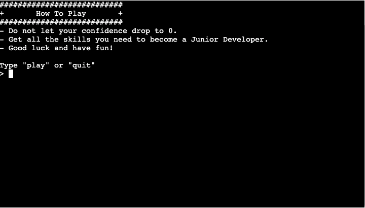

# Dev Adventures!

## Introduction
Dev Adventures is a text-based adventure game where the user takes on the journey of becoming a Full Stack Developer by answering tech questions and collecting new skills as they progress.
The game is built using python and is played by entering commands into the terminal that is provided to the user.

## Table of Contents

* [User Experience](#Introduction)
    * [Site Goals](#Site-Goals)
    * [User Stories](#User-Stories)
    * [Strategy Plane](#Strategy)
    * [Scope Plane](#Scope)
    * [Structure Plane](#Structure)
    * [Surface Plane](#Surface)
        * [Design](#Design)
    * [Features](#Features)
    * [Testing](#Testing)
    * [Bugs](#Bugs)
    * [Deployment](#Deployment)
    * [Credits](#Credits)
    
## UX

### User Stories
* As a user, when I first visit the game I would like to be given the following choices:
    - Play the game. 
    - View the game rules.
    - Quit the game.
* As a user, I want an interesting storyline.
* As a user, I want to select to be able to select a quiz room.
* As a user, I want a intructions on how to play a quiz room.
* As a user, I want a challenging game that has repercussions if I do not make the correct choice.
* As a user, I want a message to be displayed to notify me if I have gotten a question correct or incorrect.
* As a user, I want to be able to view my stats throughout the game.
* As a user, I want a score system that is tracked as I progress through each challenge.

### Site Goals
* Create a simple fun to play text based adventure.
* Provide users with an interesting story.
* Provide users with difficult questions throughout the game.
* Provide the user with pop up challenge that requires an answer within the given time limit.

### Strategy
Dev Adventures is intended to be a fun to play text based adventure that provides the user with an exciting
storyline of becoming a Full Stack Developer. The user must prove that they are worthy of becoming a Full Stack Developer
by completing a series of challenges and obtaining the required skillset to become a Developer.

### Scope
Features to be included:

- Title Screen - The first screen that the user should see when starting the game is the title screen.
The title screen displays the name of the game and gives the user options to play the game, 
view the game rules or to quit the game.

- Quiz - The game should have quiz like rooms that tests the users knowledge of the language that
they have chosen from a list of languages.

- The user should have their own stats that can change throughout the game depending on the actions that they take.

- The user should be provided with a clear indication that the game has completed.

### Structure
- The title Screen provides the user with the options to start the game, view the game rules or to exit the game.

- The introduction scene will ask the user to input their name in order to setup their stats.

- The user will be asked a series of questions as they enter each language room. The changes made to the users stats 
will have either a positive or negative impact depending on if the user has answered the question correctly or not.

- The user is presented with a message that will notify them if they have win/lost the game.

**Flow Chart**

- The screenshot above provides the logic that was used to connect all the pieces of the game together. By creating a flow chart
for the game, I was able to visualise where certain classes needed to be instantiated and manipulated in order for the game to 
work correctly.

### Surface

#### Design

### Features

#### Title Screen
- The title screen presents the user with the game title and provides options to
play the game, view the game rules or to quit the game

**User stories related to this feature:**

* As a user, when I first visit the game I would like to be given the following choices:
    - Play the game. 
    - View the game rules.
    - Quit the game.

#### Rules Screen
- The rules screen provides the user with a brief overview on how to play the game.

**User stories related to this feature:**

* As a user, when I first visit the game I would like to be given the following choices:
    - Play the game. 
    - View the game rules.
    - Quit the game.

#### Intro Scene
- The intro scene presents the user with the game story and goal. The user must enter their
name in order to create their developer character.

**User stories related to this feature:**

* As a user, I want an interesting storyline.

#### User Stats
- Once the user has inputted their name, their stats will be printed to the terminal. The users stats
are printed throughout the game so that the user can keep track of their score and confidence level. 

**User stories related to this feature:**

* As a user, I want to be able to view my stats throughout the game.
* As a user, I want a score system that is tracked as I progress through each challenge.

#### Game Over Screen

- When the user is unsucessful in completing the game, they will be presented with the game over screen.

**User stories related to this feature:**

* As a user, I want a challenging game that has repercussions if I do not make the correct choice.

#### Choose Room Screen

- The user is given the option to choose 1 of 4 languages in which they will have to answers questions 
about the language they have chosen.

**User stories related to this feature:**

* As a user, I want to select to be able to select a quiz room.

#### Room Task Screen

- When the user has chosen the language that they would like to learn, the room task message is displayed
and provides the user with information on how to proceed through the room.

**User stories related to this feature:**

* As a user, I want a intructions on how to play a quiz room.

#### Correct & Incorrect Message

- As the user plays a quiz room and answers each question correctly or incorrectly, a message is printed
to notify them if they have gotten the question correct or not. If the user answers correctly their score 
will increase. If the user does not answer correctly, their confidence level will decrease.

**User stories related to this feature:**

* As a user, I want a message to be displayed to notify me if I have gotten a question correct or incorrect.

#### Technologies

* Random
    - The random module was used to receive random choices from lists and to shuffle items in a list.

* Time
    - The time module allowed me to set certain time intervals that the player would have to wait for until
    the next part of the game would execute.

* OS
    - The OS module allowed me to create the clear_terminal function so that any text displayed in the terminal would be removed
    when the function was invoked.

### Testing

#### Manual Testing

#### Pep8 Validator
Pep8 validator was used to validate all python code.

**game.py**

**functions.py**

**player.py**

**questions.py**

**rooms.py**

**setup.py**

### Bugs

#### Fixed Bugs
- Questions that contain of "All of the above" as an answer needed to be corrected due to the order of the answers being shuffled
and not placing the "All of the above" answer as the last answer. This bug was corrected by removing the "All of the above" answer from
the list of answers and re-adding it back to the list so that it will always be positioned at the last index of the choices.

### Deployment
Deploying the project using Heroku:

- Visit the [Heroku](https://id.heroku.com/login) site.
- Sign in.
- Click the "New" button.
- Click the "Create new app" button.
- Provide a name for the app in the App name input field.
- Select your region from the choose region dropdown menu.
- Click the "Create App" button.
- Once redirected, proceed to the settings tab.
- Click on the "config vars" button.
- Supply a KEY of PORT and it's value of 8000. The click the "add" button.
- Next step is to add Buildpacks.
- Click the "Add buildpack" button.
- The python buildpack needs to be added first then the nodejs buildpack.
- Once both of the buildpacks have finished being added, proceed to the deploy tab.
- Once in the deploy screen, select GitHub as the deployment method and connect your GitHub profile.
- Search for the repository that you wish to deploy to Heroku and click "connect".
- Once your repository is connected to Heroku you can choose to either manually or automatically deploy
your app.
- By selecting automatic deploys, Heroku will build a new version of the app each time a change has been
pushed to the repository.
- Manual deploys allow you to build a new version of your app whenever you click manual deploy.
- If your build is successful you will then be able to visit the live site by clicking the link that is provided to you
by Heroku.

### Credits
* [ASCII Art](https://www.asciiart.eu/computers) is used to create the "Game Over" screen design and the laptop design in the title screen.
* [Python Classes with Corey Schafer](https://www.youtube.com/watch?v=ZDa-Z5JzLYM&list=PL-osiE80TeTsqhIuOqKhwlXsIBIdSeYtc) was incredibly helpful
for my understaning of OOP and general python classes.